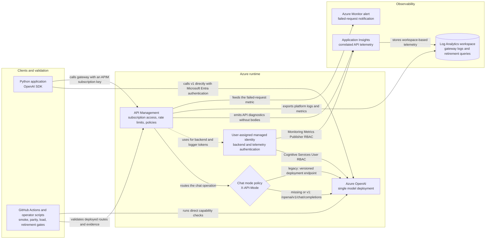

# OpenAI SDK and API v1 migration

**English** | [Português (Brasil)](README.pt-BR.md)

This proof of concept addresses the Azure AI Inference SDK retirement announced for August 26, 2026. It demonstrates the migration from `azure-ai-inference` + `/models` to `openai` + `/openai/v1` and provisions a temporary Azure API Management (APIM) facade for comparing v1 with the versioned Azure OpenAI API.

## Scope

1. Calls through the stable `openai` SDK using `model=<deployment-name>` without `api-version`.
2. Direct Azure OpenAI and APIM gateway smoke tests.
3. Opt-in checks for streaming, the Responses API, tools, structured outputs, embeddings, images, audio, batch, and fine-tuning.
4. Checks for `429` retries, timeouts, cancellation, safety, bounded load, estimated cost, and legacy/v1 behavioral parity.
5. APIM with one dual-mode chat operation, managed identity, rate limiting, retries, product/subscription access, logs, and failure alerts.
6. Deterministic pull-request gates and protected manual live tests.
7. Validators and operational reports that do not export keys, prompts, or responses.

## Architecture



Arrows show request, validation, telemetry, or authorization flow. All deployed request paths reach the same model deployment. The optional private-networking mode places APIM in a VNet and reaches Azure OpenAI through a private endpoint and private DNS; those network resources are omitted above to keep the routing decision readable.

The dual policy applies only to the existing chat operation. Other APIM operations use v1 directly. The policy does not fall back after a failure: a missing header preserves the v1 backend, while any non-empty value other than `v1|legacy` returns `400 invalid_api_mode`.

## Repository layout

| Path | Purpose |
| --- | --- |
| `infra/` | Subscription-scoped Bicep and compiled ARM for Azure OpenAI, APIM, observability, and RBAC. |
| `samples/` | Reference APIM policies for v1 and dual-mode chat. |
| `scripts/validate-live-migration.ps1` | Runs the complete deployed migration gate while keeping the APIM key in process memory. |
| `scripts/rotate-apim-key.ps1` | Rotates the protected APIM key, validates the new slot, then invalidates the old slot. |
| `scripts/promote-apim-revision.ps1` | Promotes a canary-tested APIM revision and automatically restores the stable revision on failure. |
| `scripts/remove-obsolete-apim-operation.ps1` | Safely removes an operation that an incremental ARM deployment cannot delete. |
| `tests/` | Deterministic tests run locally and in CI. |
| `smoke_test.py` | Direct/APIM smoke tests for default, v1, and legacy modes. |
| `capability_test.py` | Opt-in probes for OpenAI API v1 capabilities. |
| `compare_responses.py` | Behavioral comparison without logging generated text. |
| `load_test.py` | Bounded load test with client reuse, optional warm-up, and latency/token/cost reporting. |
| `migration_scan.py` | Fleet scanner for legacy SDKs, clients, endpoints, and dated API versions. |
| `retirement_report.py` | Fail-closed retirement evidence from correlated Application Insights telemetry. |
| `validate_apim.py` | Live or offline APIM configuration validation with secret redaction. |
| `RUNBOOK.md` | Alert triage, rollback, key recovery, scaling, private networking, cleanup, and escalation procedures. |
| `pyproject.toml` | pytest, Ruff, and mypy configuration. |
| `requirements.txt` | Runtime dependencies (v1 SDK plus the legacy comparison SDK). |
| `requirements-dev.txt` | Optional pytest/coverage/Ruff/mypy/pip-audit tooling for local and CI quality checks. |

## Prerequisites

- Python 3.10 or later (CI validates 3.10-3.13).
- Authenticated Azure CLI and Azure Developer CLI (`azd`).
- Permission to create the resources in `infra/` and assign RBAC roles.
- For smoke tests: an active deployment, an APIM key, and an Entra identity with access for direct testing.
- The APIM managed identity must have `Cognitive Services User` on the AI resource.
- PowerShell 7 for the operational scripts in `scripts/`.

## Install and test locally

```powershell
python -m venv .venv
.\.venv\Scripts\Activate.ps1
python -m pip install -r requirements.txt -r requirements-dev.txt
python -m pytest --cov --cov-branch --cov-report=term-missing --cov-report=xml --cov-fail-under=65
python -m ruff check .
python -m mypy
python -m pip_audit --no-deps -r requirements.txt
az bicep build --file infra/main.bicep --outfile .\infra\main.json
az bicep lint --file infra/main.bicep
az bicep lint --file infra/resources.bicep
```

The deterministic suite covers client construction and normalization, async cancellation and cleanup, capability adapters, thread-local load clients, response comparison, legacy migration findings, retirement evidence, APIM validation, secret redaction, retries, and CLI exit behavior. These tests use mocks at SDK, Azure CLI, and process boundaries and require no live Azure credentials. The coverage command measures branches, prints missing lines, writes `coverage.xml`, and enforces the same 65% floor as CI.

The `Migration validation` GitHub Actions workflow runs the suite across Python 3.10-3.13 with blocking Ruff and mypy checks and audits runtime dependencies in a clean Python 3.13 environment. It also builds and lints Bicep, parses generated and parameter ARM JSON, analyzes every operational PowerShell script with PSScriptAnalyzer, and uploads `migration-scan.sarif`. Dependabot checks pip and GitHub Actions dependencies weekly, while workflow actions are pinned to immutable commit SHAs. `requirements-dev.txt` is optional and only supports local and CI quality checks; the command-line tools do not require it at runtime. The optional `.pre-commit-config.yaml` runs the same non-mutating Ruff check before commits.

## Scan an application fleet

Scan one or more repository roots before planning migration waves:

```powershell
python .\migration_scan.py C:\Git\app-one C:\Git\app-two --format json --output migration-scan.json
python .\migration_scan.py C:\Git\app-one --format sarif --output migration-scan.sarif --fail-on-findings
```

The scanner reports `azure-ai-inference`, `ChatCompletionsClient`, `/models`, dated `api-version` values, `AzureOpenAI(`, and `/openai/deployments/` as rules `AOAI001` through `AOAI006`. It accepts repeatable `--exclude` directory names and ignores common virtual environments, caches, build output, and dependency folders by default. Use `--fail-on-findings` in consumer repositories after approving their baseline. This POC intentionally retains a legacy client and route as the comparison control, so its own CI preserves SARIF evidence without treating expected findings as a failure.

## Provision with Azure Developer CLI

The project includes `azd`-compatible Bicep that creates an isolated environment with Azure OpenAI, a `gpt-4.1-mini` deployment, APIM Developer, a managed identity, Application Insights, Log Analytics, alerts, and RBAC.

```powershell
azd auth login
azd env new '<environment-name>' --no-prompt
azd env set AZURE_SUBSCRIPTION_ID '<subscription-id>'
azd env set AZURE_LOCATION 'brazilsouth'
azd env set APIM_LOCATION 'centralus'
azd env set APIM_PUBLISHER_EMAIL '<publisher-email>'
azd env set TELEMETRY_READER_PRINCIPAL_ID '<telemetry-reader-object-id>'
azd provision
```

`TELEMETRY_READER_PRINCIPAL_ID` is optional. When set, Bicep grants `Monitoring Reader` only on the Application Insights component; access to the Log Analytics workspace is not required. Retrieve the signed-in user's object ID with `az ad signed-in-user show --query id -o tsv`.

The deployment also accepts these optional `azd` settings; the values shown are the defaults from `infra/main.parameters.json`:

| Setting | Default | Purpose |
| --- | --- | --- |
| `AZURE_OPENAI_MODEL_NAME` | `gpt-4.1-mini` | Model deployed by Azure OpenAI. |
| `AZURE_OPENAI_MODEL_VERSION` | `2025-04-14` | Model version. |
| `AZURE_OPENAI_DEPLOYMENT_SKU` | `GlobalStandard` | Deployment SKU. |
| `AZURE_OPENAI_DEPLOYMENT_CAPACITY` | `4990` | Point-in-time maximum scale target for the existing `gpt-4.1-mini` Global Standard deployment in Brazil South; recheck capacity before provisioning. |
| `APIM_SKU_NAME` / `APIM_CAPACITY` | `Developer` / `1` | APIM tier and units. |
| `APIM_RATE_LIMIT_CALLS_PER_MINUTE` | `60` | Per-subscription or caller-IP requests allowed each minute. |
| `APIM_BACKEND_RETRY_COUNT` / `APIM_BACKEND_RETRY_INTERVAL_SECONDS` | `2` / `1` | APIM retries and initial interval for backend `5xx` responses only. |
| `APIM_TELEMETRY_SAMPLING_PERCENTAGE` | `100` | Percentage of APIM request telemetry sent to Application Insights. |
| `APIM_FAILED_REQUESTS_ALERT_THRESHOLD` | `5` | Failures in five minutes that trigger the alert. |
| `APIM_ALERT_EMAIL` | publisher email | Alert recipient when different from the APIM publisher. |
| `ENABLE_PRIVATE_NETWORKING` | `false` | Enables APIM VNet integration and the Azure OpenAI private endpoint. |
| `APIM_SUBNET_RESOURCE_ID` | empty | Dedicated APIM subnet; required with private networking. |
| `PRIVATE_ENDPOINT_SUBNET_RESOURCE_ID` | empty | Private endpoint subnet; required with private networking. |
| `VIRTUAL_NETWORK_RESOURCE_ID` | empty | VNet linked to the Azure OpenAI private DNS zone. |

The `4990` capacity default is the scale target for the existing deployment in this subscription, calculated on August 21, 2026 as its current `10` units plus `4980` additional units reported by the Azure Model Capacities API. Each unit of this `gpt-4.1-mini` Global Standard deployment provides 1,000 TPM and 1 RPM, so the target represents 4.99 million TPM and 4,990 RPM.

Capacity availability changes with subscription quota, regional service capacity, and other deployments. Before provisioning, use the Model Capacities API procedure in `RUNBOOK.md`. When scaling this same deployment, the maximum target is its current capacity plus `availableCapacity`. For a new deployment, the target cannot exceed `availableCapacity`. Set a lower value when the API reports less capacity:

```powershell
azd env set AZURE_OPENAI_DEPLOYMENT_CAPACITY '<available-capacity>'
```

APIM provisioning can take several minutes. When it completes, `azd` stores non-secret endpoints and resource names in the environment. Load them into the current session and select the same Azure subscription:

```powershell
azd env get-values | ForEach-Object {
  if ($_ -match '^([^=]+)="(.*)"$') {
    [Environment]::SetEnvironmentVariable($Matches[1], $Matches[2], 'Process')
  }
}
az account set --subscription $env:AZURE_SUBSCRIPTION_ID
```

Variables with `Process` scope exist only in that terminal. Repeat the block in each new session.

Retrieve only the APIM subscription key into the terminal process. Local authentication is disabled on the Azure OpenAI account; direct calls and the APIM backend use Microsoft Entra ID.

```powershell
$env:APIM_SUBSCRIPTION_KEY = az rest --method post `
  --uri "$(az apim show --resource-group "rg-$(azd env get-value AZURE_ENV_NAME)" --name $env:APIM_SERVICE_NAME --query id -o tsv)/subscriptions/$env:APIM_SUBSCRIPTION_ID/listSecrets?api-version=2024-05-01" `
  --query primaryKey -o tsv
```

After the POC, use `azd down` to remove the environment and review the resources before confirming deletion.

## Validate APIM configuration

Use the internal API identifier, not its display name:

```powershell
python .\validate_apim.py `
  --resource-group '<resource-group>' `
  --service-name '<apim-name>' `
  --api-id '<api-id>' `
  --export '.\apim-snapshot.json'
```

The command returns `0` when it finds no incompatibilities and `1` when it finds errors. You can review the snapshot without Azure access:

```powershell
python .\validate_apim.py --snapshot .\apim-snapshot.json
```

Required criteria include a route or rewrite containing `/openai/v1`, a `chat/completions` operation, no `/models`, and backend authentication through managed identity or `api-key`. `api-version` and `/openai/deployments/` are allowed only in a complete `legacy` branch of the dual policy. See [APIM policy for OpenAI API v1](docs/apim-policy.md) for details. This linked policy guide is currently available in Portuguese.

Exported snapshots and validation findings are sanitized before they are written or printed: authorization headers, subscription keys, named-value secrets marked `secret`, backend credential parameters/headers/query values, and connection-string-style secrets (`SharedAccessKey`, `AccountKey`, SAS `sig=` parameters) are replaced with `***REDACTED***`. `tests/test_validate_apim.py` proves this with synthetic fake secrets that must never appear in exported JSON or finding messages. Never commit a real `apim-snapshot.json`; `.gitignore` already excludes it.

## Run smoke tests

### Direct Azure OpenAI

```powershell
$env:AZURE_OPENAI_BASE_URL = 'https://<resource>.openai.azure.com/openai/v1/'
$env:AZURE_OPENAI_DEPLOYMENT = '<deployment-name>'
python .\smoke_test.py --target direct
```

The client uses `DefaultAzureCredential` with the `https://ai.azure.com/.default` scope. Set `OPENAI_TIMEOUT_SECONDS` and `OPENAI_MAX_RETRIES` when the defaults of 30 seconds and two additional attempts are not appropriate. To test asynchronous cancellation:

```powershell
python .\smoke_test.py --target direct --cancel-after 0.1
```

### Through APIM

```powershell
$env:APIM_OPENAI_BASE_URL = 'https://<apim>.azure-api.net/openai/v1/'
$env:APIM_SUBSCRIPTION_KEY = '<subscription-key>'
$env:AZURE_OPENAI_DEPLOYMENT = '<deployment-name>'
python .\smoke_test.py --target apim
```

The base URL must end with the prefix exposing API v1. The policy removes the technical `Authorization` header created by the SDK and authenticates the backend through the APIM managed identity.

The OpenAI SDK owns `429` retry and backoff behavior through `OPENAI_MAX_RETRIES`. APIM retries only `5xx` backend responses. This avoids multiplying retries across both layers during throttling and keeps client-visible quota pressure measurable.

## Keep legacy and v1 during transition

The `--api-mode` option selects the protocol without mixing URLs, authentication scopes, or SDKs. Set the complete legacy endpoint, including `/models`:

```powershell
$env:LEGACY_MODELS_BASE_URL = 'https://<resource>.services.ai.azure.com/models'
$env:AZURE_OPENAI_DEPLOYMENT = '<deployment-name>'

python .\smoke_test.py --api-mode legacy --target direct
python .\smoke_test.py --api-mode v1 --target direct
```

Through APIM, the existing `/openai/v1/chat/completions` operation supports backend selection. A missing header or `X-API-Mode: v1` keeps v1; `X-API-Mode: legacy` selects the versioned route on the same Azure OpenAI resource. The smoke test sets the header automatically:

```powershell
python .\smoke_test.py --api-mode default --target apim
python .\smoke_test.py --api-mode v1 --target apim
python .\smoke_test.py --api-mode legacy --target apim
python .\compare_responses.py --target apim
```

To compare both direct paths without logging generated text:

```powershell
python .\compare_responses.py --target direct
```

For a repeatable release gate, run the JSONL corpus and persist the sanitized report:

```powershell
python .\compare_responses.py --target apim `
  --corpus .\samples\parity-corpus.jsonl `
  --min-pass-rate 1.0 `
  --output .\parity-report.json
```

Each non-empty JSONL line requires a unique string `id` and a string `prompt`. Optional fields are `max_tokens`, `max_length_ratio`, `expected_finish_reason`, `expected_tool_call_count`, `tools`, `tool_choice`, and `response_format`. The pass rate is the fraction of scenarios whose normalized legacy and v1 behavior passes every configured check. Generated text is not written to the report. The original single-prompt mode remains available when `--corpus` is omitted.

Only chat is dual-mode. Responses, embeddings, images, audio, files, batches, fine-tuning, cancellation, and advanced capability tests remain v1-only.

## Capabilities, resilience, and load

List options with `python .\capability_test.py --help`. Capabilities that require another deployment or file return `skipped`; a skipped capability does not fail the process. Batch and fine-tuning are guarded before any client operation and create uploads or jobs only with the explicit `--execute-mutating` flag. The runner rejects legacy mode because advanced capabilities are v1-only and emits sanitized exception types rather than exception text.

```powershell
python .\capability_test.py --target direct --capability all
$env:OPENAI_SAFETY_PROMPT = '<approved-test-prompt>'
python .\capability_test.py --target apim --capability safety
```

The load test allows at most 10,000 requests per mode with concurrency capped at 100. Runs above 1,000 requests per mode require `--confirm-large-load`. Each worker thread builds and reuses one client per API mode instead of creating a new client per request, so measured latency reflects request time rather than repeated client/connection setup. Use `--warmup-requests` (0-100, default 0) to run unmeasured requests first and prime connections/auth tokens before the timed run. Any warmup failure emits only a sanitized exception classification and aborts before measured traffic begins. Reports include percentiles, tokens, `failures_by_type` (exception class), `failures_by_category` (`transport` for connection/timeout failures, `request` for HTTP/configuration failures, `other` otherwise), and cost only when approved rates are supplied:

```powershell
$env:OPENAI_INPUT_USD_PER_1M_TOKENS = '<rate>'
$env:OPENAI_OUTPUT_USD_PER_1M_TOKENS = '<rate>'
python .\load_test.py --target apim --api-mode both --requests 20 --concurrency 4 --warmup-requests 5
```

`--requests` applies to each mode. The example makes 20 v1 calls followed by 20 legacy calls. The process returns a non-zero exit code if any request fails.

## Operations and delivery

### Local live gate

After `azd provision`, run all live gates without printing or persisting the APIM key:

```powershell
.\scripts\validate-live-migration.ps1
```

The script resolves `azd` outputs, holds the key only in memory, validates APIM, runs `default`, `v1`, and `legacy` smoke tests, compares both modes, and queries sanitized Application Insights traces. Use `-SkipTelemetryCheck` only when the identity does not have `Monitoring Reader` on the component.

### GitHub Actions

The tracked, manual `Live migration gate` workflow uses the protected `openai-migration-live` environment. Configure the variables `AZURE_CLIENT_ID`, `AZURE_TENANT_ID`, `AZURE_SUBSCRIPTION_ID`, `AZURE_OPENAI_BASE_URL`, `LEGACY_MODELS_BASE_URL`, `AZURE_OPENAI_DEPLOYMENT`, and `APIM_OPENAI_BASE_URL`. Configure `APIM_SUBSCRIPTION_KEY` as a secret. Azure authentication uses OIDC federation and pinned actions; do not store client secrets.

The dispatch inputs are `target`, `run_load_test`, `minimum_parity_pass_rate`, `legacy_p95_baseline_ms`, `application_insights_name`, `resource_group`, `rollback_rehearsed`, `owner_approved`, and `enforce_retirement_ready`. Ordinary APIM smoke, parity, capability, and load validation does not require the telemetry inputs. Retirement evidence is generated only when both `application_insights_name` and `resource_group` are supplied. When `enforce_retirement_ready` is enabled, omitting either value fails immediately with a prerequisite error. Provide the approved legacy p95 baseline and the rollback and owner approvals for a retirement decision. The workflow uploads available `parity-report.json` and `retirement-report.json` artifacts even when a gate fails.

See [the operational runbook](RUNBOOK.md) for alert triage, rollback, key rotation recovery, scaling, private-network diagnosis, cleanup, and escalation evidence.

### Remove the obsolete operation

Incremental ARM deployments do not delete operations removed from Bicep. Run this cleanup once, only after provisioning and validating the dual-mode policy:

```powershell
.\scripts\remove-obsolete-apim-operation.ps1 -ResourceGroup $env:AZURE_RESOURCE_GROUP `
  -ServiceName $env:APIM_SERVICE_NAME -ApiId $env:APIM_API_ID -WhatIf

.\scripts\remove-obsolete-apim-operation.ps1 -ResourceGroup $env:AZURE_RESOURCE_GROUP `
  -ServiceName $env:APIM_SERVICE_NAME -ApiId $env:APIM_API_ID -Confirm:$false
```

### Rotate keys and promote revisions

Bicep provisions the APIM product and subscription but does not return their keys. This script regenerates one slot, updates a GitHub environment secret through `gh`, runs the smoke test, and only then invalidates the old slot:

```powershell
.\scripts\rotate-apim-key.ps1 -ResourceGroup '<rg>' -ServiceName '<apim>' `
  -SubscriptionId $env:APIM_SUBSCRIPTION_ID -NewKeySlot secondary `
  -GitHubEnvironment openai-migration-live
```

Promote a candidate revision only after configuring it. The command tests the `;rev=N` URL, promotes it, repeats bounded smoke/load checks, and automatically restores the stable revision after any failure:

```powershell
.\scripts\promote-apim-revision.ps1 -ResourceGroup '<rg>' -ServiceName '<apim>' `
  -ApiId $env:APIM_API_ID -StableRevision 1 -CandidateRevision 2
```

Log Analytics receives APIM logs and metrics, and an alert notifies the publisher after more than five failures in five minutes. Do not add prompts, responses, tokens, or keys to logging policies.

## Legacy retirement criteria

- 14 consecutive days without `legacy` requests from active clients;
- v1 success rate of at least 99.5% during that window;
- v1 p95 latency no more than 10% above the approved legacy baseline, excluding provider-wide incidents;
- passing capability and APIM-to-APIM comparison tests, with intentional differences accepted;
- a rehearsed rollback that restores the previous policy within 15 minutes without changing the public URL;
- formal approval from the cutover owner.

Generate the decision record directly from Application Insights:

```powershell
python .\retirement_report.py `
  --application-insights-name '<component-name>' `
  --subscription-id '<subscription-id>' `
  --resource-group '<resource-group>' `
  --legacy-p95-baseline-ms 5000 `
  --min-v1-requests 100 `
  --max-v1-last-request-age-hours 24 `
  --rollback-rehearsed `
  --parity-passed `
  --owner-approved `
  --require-ready `
  --output .\retirement-report.json
```

The report correlates APIM routing traces with requests and summarizes 7, 14, and 30-day windows. Readiness requires complete request correlation, at least 100 v1 requests in the 14-day window, a latest v1 request no older than 24 hours, zero legacy requests over 14 days, at least 99.5% v1 success, v1 p95 within 10% of the approved legacy baseline, a passing parity run, a rehearsed rollback, and owner approval. Override the volume and recency defaults with `--min-v1-requests` and `--max-v1-last-request-age-hours` only when the change record documents the rationale. Missing, stale, or future-dated telemetry, a missing baseline, or a missing approval fails closed. Without `--require-ready`, the command still writes evidence but does not turn a not-ready decision into a process failure. An exported Application Insights query response can be evaluated offline with `--input`.

After cutover, keep the legacy branch disabled but recoverable for seven days. Remove it through Bicep after that period.

## Private networking and production

For private networking, provide dedicated subnets and the VNet before provisioning. Bicep injects APIM into the VNet, creates the Azure OpenAI private endpoint and DNS, and disables public access to Azure OpenAI:

```powershell
azd env set ENABLE_PRIVATE_NETWORKING true
azd env set APIM_SUBNET_RESOURCE_ID '<subnet-resource-id>'
azd env set PRIVATE_ENDPOINT_SUBNET_RESOURCE_ID '<subnet-resource-id>'
azd env set VIRTUAL_NETWORK_RESOURCE_ID '<vnet-resource-id>'
```

When private networking is enabled, Bicep validates all three resource IDs with stable `fail()` expressions at both the subscription entry point and reusable module. A blank value stops deployment with the name of the missing parameter before resource provisioning begins. Empty values remain valid when private networking is disabled.

The Developer SKU is suitable for this POC but has no production SLA. Before customer traffic, choose a SKU with suitable SLA and capacity, validate DNS and TCP 443 from the gateway, and define approved error and latency thresholds.

The live gate is a synthetic canary, not percentage-based traffic splitting. For weighted canary delivery, keep parallel APIs/backends and route by cohort or percentage in a production-approved layer.

## Acceptance criteria

- The validator exits with zero errors.
- Direct and APIM calls return non-empty content from the same deployment.
- No v1 request contains `api-version` or uses `/models`.
- The legacy branch uses `api-version=2024-10-21` only inside the APIM policy and never exposes it in the public contract.
- An invalid APIM key returns `401` or `403`.
- APIM authenticates to the backend through managed identity with the `https://ai.azure.com` audience.
- APIM logs status and latency without capturing prompts, responses, or keys.

## Environment variable reference

| Variable | Used by | Purpose |
| --- | --- | --- |
| `AZURE_OPENAI_BASE_URL` | `smoke_test.py`, `load_test.py` (`--target direct`) | Direct v1 endpoint, e.g. `https://<resource>.openai.azure.com/openai/v1/`. |
| `AZURE_OPENAI_DEPLOYMENT` | all scripts | Deployment/model name used for chat/capability calls. |
| `APIM_OPENAI_BASE_URL` | `smoke_test.py`, `load_test.py`, `compare_responses.py` (`--target apim`) | Public APIM `/openai/v1/` base URL. |
| `APIM_SUBSCRIPTION_KEY` | same as above | APIM subscription key sent as `Ocp-Apim-Subscription-Key`. Never log or print this value. |
| `APIM_CLIENT_API_KEY` | `smoke_test.py` (`--target apim`) | Placeholder OpenAI SDK `api_key`; the real credential is enforced by APIM. |
| `LEGACY_MODELS_BASE_URL` | `smoke_test.py` (`--api-mode legacy --target direct`) | Legacy `azure-ai-inference` `/models` endpoint used only for comparison. |
| `OPENAI_TIMEOUT_SECONDS` | `smoke_test.py` client options | Per-request timeout; defaults to 30. |
| `OPENAI_MAX_RETRIES` | `smoke_test.py` client options | SDK-managed retry attempts; defaults to 2. |
| `OPENAI_INPUT_USD_PER_1M_TOKENS` / `OPENAI_OUTPUT_USD_PER_1M_TOKENS` | `load_test.py` | Optional approved rates enabling `estimated_cost_usd` in reports. |
| `OPENAI_SAFETY_PROMPT` | `capability_test.py --capability safety` | Approved synthetic prompt for the safety/content-filter probe. |
| `AZURE_SUBSCRIPTION_ID` | `validate_apim.py` (live mode), `azd`/`az` commands | Subscription containing the APIM service, when not inferred from `az account show`. |
| `AZURE_CLIENT_ID` / `AZURE_TENANT_ID` | GitHub Actions live gate (OIDC) | Federated identity used only by the manual, protected live-migration workflow. |

Set these with `$env:NAME = 'value'` in PowerShell for the current session only; never commit them. `smoke_test.py`, `capability_test.py`, `compare_responses.py`, and `load_test.py` fail fast with a clear message when a required variable is missing.

## POC evidence

Record the validator report, smoke-test timestamp/status/latency, APIM request ID, and a screenshot of the RBAC assignment. Do not include keys, tokens, real customer prompts, or sensitive responses.

## Official references

- [Migrate from Azure AI Inference SDK to OpenAI SDK](https://learn.microsoft.com/azure/foundry/how-to/model-inference-to-openai-migration)
- [API v1 lifecycle](https://learn.microsoft.com/azure/foundry/openai/api-version-lifecycle)
- [Authenticate Azure OpenAI from APIM](https://learn.microsoft.com/azure/api-management/api-management-authenticate-authorize-azure-openai)
