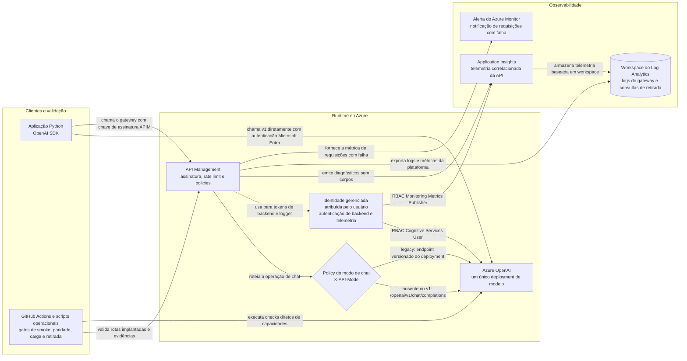

# POC de migração para OpenAI SDK e API v1

[English](README.md) | **Português (Brasil)**

POC baseada no aviso de descontinuação do Azure AI Inference SDK em 26/08/2026. Ela comprova a troca de `azure-ai-inference` + `/models` por `openai` + `/openai/v1` e provisiona uma fachada temporária no Azure API Management (APIM) para comparar v1 e a API Azure OpenAI versionada.

## Escopo

1. Chamada com o SDK estável `openai`, usando `model=<nome-do-deployment>` e sem `api-version`.
2. Smoke test direto no Azure OpenAI e pelo gateway APIM.
3. Streaming, Responses API, tools, structured outputs, embeddings, imagens, áudio, batch e fine-tuning com execução opt-in.
4. Retry de `429`, timeout, cancelamento, segurança, carga limitada, custo estimado e comparação comportamental legado/v1.
5. APIM com operação de chat dual-mode, identidade gerenciada, rate limit, retry, produto/assinatura, logs e alerta de falhas.
6. Gates determinísticos em pull requests e testes live manuais protegidos por ambiente.
7. Nenhuma chave, prompt ou resposta é exportada pelo validador e relatórios operacionais.

## Arquitetura



As setas representam fluxos de requisição, validação, telemetria ou autorização. Todos os caminhos implantados chegam ao mesmo deployment do modelo. O modo opcional de rede privada coloca o APIM em uma VNet e acessa o Azure OpenAI por um private endpoint e DNS privado; esses recursos de rede foram omitidos acima para manter a decisão de roteamento legível.

A política dual cobre somente a operação existente de chat. As demais operações do APIM usam v1 diretamente. Ela não faz fallback em caso de falha: header ausente preserva o backend v1, enquanto um valor não vazio diferente de `v1|legacy` retorna `400 invalid_api_mode`.

## Estrutura do repositório

| Caminho | Finalidade |
| --- | --- |
| `infra/` | Bicep de escopo de assinatura e ARM compilado para Azure OpenAI, APIM, observabilidade e RBAC. |
| `samples/` | Policies APIM de referência para v1 e chat dual-mode. |
| `scripts/validate-live-migration.ps1` | Executa o gate completo no ambiente implantado, mantendo a chave APIM somente na memória do processo. |
| `scripts/rotate-apim-key.ps1` | Rotaciona a chave protegida do APIM, valida o novo slot e só então invalida o slot antigo. |
| `scripts/promote-apim-revision.ps1` | Promove uma revisão APIM validada como canário e restaura automaticamente a revisão estável em caso de falha. |
| `scripts/remove-obsolete-apim-operation.ps1` | Remove com segurança uma operação que um deployment ARM incremental não consegue excluir. |
| `tests/` | Testes determinísticos executados localmente e no CI. |
| `smoke_test.py` | Smoke tests direto/APIM para os modos padrão, v1 e legado. |
| `capability_test.py` | Probes opt-in das capacidades da API v1. |
| `compare_responses.py` | Comparação comportamental sem registrar o texto gerado. |
| `load_test.py` | Teste de carga limitado com reuso de cliente, warm-up opcional e relatório de latência/tokens/custo. |
| `migration_scan.py` | Scanner de repositórios para SDKs, clientes, endpoints e versões de API legados. |
| `retirement_report.py` | Evidência fail-closed para retirada do legado com telemetria correlacionada do Application Insights. |
| `validate_apim.py` | Validação live ou offline da configuração APIM com redação de segredos. |
| `RUNBOOK.md` | Triagem de alertas, rollback, recuperação de chaves, escala, rede privada, limpeza e escalonamento. |
| `pyproject.toml` | Configuração de pytest, Ruff e mypy. |
| `requirements.txt` | Dependências de runtime (SDK v1 e SDK de comparação legada). |
| `requirements-dev.txt` | Ferramentas opcionais de pytest/cobertura/Ruff/mypy/pip-audit para checks locais e no CI. |

## Pré-requisitos

- Python 3.10 ou posterior (o CI valida 3.10-3.13).
- Azure CLI e Azure Developer CLI (`azd`) autenticadas.
- Permissão para criar os recursos descritos em `infra/` e atribuir papéis RBAC.
- Para o smoke test: deployment ativo, chave do APIM e identidade Entra com acesso no teste direto.
- A identidade gerenciada do APIM deve possuir `Cognitive Services User` no recurso de IA.
- PowerShell 7 para os scripts operacionais em `scripts/`.

## Instalação e testes locais

```powershell
python -m venv .venv
.\.venv\Scripts\Activate.ps1
python -m pip install -r requirements.txt -r requirements-dev.txt
python -m pytest --cov --cov-branch --cov-report=term-missing --cov-report=xml --cov-fail-under=65
python -m ruff check .
python -m mypy
python -m pip_audit --no-deps -r requirements.txt
az bicep build --file infra/main.bicep --outfile .\infra\main.json
az bicep lint --file infra/main.bicep
az bicep lint --file infra/resources.bicep
```

A suíte determinística cobre construção e normalização de clientes, cancelamento assíncrono e cleanup, adaptadores de capacidades, clientes thread-local do teste de carga, comparação de respostas, findings de migração legada, evidência de retirada, validação do APIM, redação de segredos, retries e comportamento de saída dos CLIs. Esses testes usam mocks nos limites dos SDKs, Azure CLI e processos e não exigem credenciais Azure live. O comando de cobertura mede branches, exibe linhas não cobertas, grava `coverage.xml` e aplica o mesmo limite mínimo de 65% do CI.

O workflow `Migration validation` do GitHub Actions executa a suíte em Python 3.10-3.13, com Ruff e mypy bloqueantes, e audita as dependências de runtime em um ambiente Python 3.13 limpo. Ele também compila e valida o Bicep, faz parse dos JSONs ARM gerado e de parâmetros, analisa todos os scripts PowerShell operacionais com PSScriptAnalyzer e publica `migration-scan.sarif`. O Dependabot verifica semanalmente dependências pip e GitHub Actions, enquanto as actions dos workflows são fixadas por SHA imutável. `requirements-dev.txt` é opcional e atende somente aos checks locais e de CI; os comandos não precisam dele em runtime. O `.pre-commit-config.yaml` opcional executa o mesmo check não mutável do Ruff antes dos commits.

## Escanear uma frota de aplicações

Escaneie uma ou mais raízes de repositórios antes de planejar as ondas de migração:

```powershell
python .\migration_scan.py C:\Git\app-um C:\Git\app-dois --format json --output migration-scan.json
python .\migration_scan.py C:\Git\app-um --format sarif --output migration-scan.sarif --fail-on-findings
```

O scanner identifica `azure-ai-inference`, `ChatCompletionsClient`, `/models`, valores datados de `api-version`, `AzureOpenAI(` e `/openai/deployments/` nas regras `AOAI001` a `AOAI006`. Ele aceita nomes de diretório repetíveis em `--exclude` e ignora por padrão ambientes virtuais, caches, saídas de build e pastas de dependências comuns. Use `--fail-on-findings` nos repositórios consumidores depois de aprovar o baseline. Esta POC preserva intencionalmente o cliente e a rota legados como controle de comparação; por isso, seu próprio CI publica o SARIF sem transformar findings esperados em falha.

## Provisionar com Azure Developer CLI

O projeto inclui Bicep compatível com `azd` para criar um ambiente isolado com Azure OpenAI, deployment `gpt-4.1-mini`, APIM Developer, identidade gerenciada, Application Insights, Log Analytics, alertas e RBAC.

```powershell
azd auth login
azd env new '<nome-do-ambiente>' --no-prompt
azd env set AZURE_SUBSCRIPTION_ID '<subscription-id>'
azd env set AZURE_LOCATION 'brazilsouth'
azd env set APIM_LOCATION 'centralus'
azd env set APIM_PUBLISHER_EMAIL '<email-do-publisher>'
azd env set TELEMETRY_READER_PRINCIPAL_ID '<object-id-do-leitor-de-telemetria>'
azd provision
```

`TELEMETRY_READER_PRINCIPAL_ID` é opcional. Quando definido, o Bicep concede `Monitoring Reader` somente no componente Application Insights; não é necessário conceder acesso ao workspace Log Analytics. Para o usuário autenticado, obtenha o object ID com `az ad signed-in-user show --query id -o tsv`.

O deployment também aceita as configurações opcionais abaixo no `azd`; os valores exibidos são os padrões de `infra/main.parameters.json`:

| Configuração | Padrão | Finalidade |
| --- | --- | --- |
| `AZURE_OPENAI_MODEL_NAME` | `gpt-4.1-mini` | Modelo implantado no Azure OpenAI. |
| `AZURE_OPENAI_MODEL_VERSION` | `2025-04-14` | Versão do modelo. |
| `AZURE_OPENAI_DEPLOYMENT_SKU` | `GlobalStandard` | SKU do deployment. |
| `AZURE_OPENAI_DEPLOYMENT_CAPACITY` | `10` | Capacidade do deployment. |
| `APIM_SKU_NAME` / `APIM_CAPACITY` | `Developer` / `1` | Camada e unidades do APIM. |
| `APIM_RATE_LIMIT_CALLS_PER_MINUTE` | `60` | Requisições permitidas por minuto por assinatura ou IP do cliente. |
| `APIM_BACKEND_RETRY_COUNT` / `APIM_BACKEND_RETRY_INTERVAL_SECONDS` | `2` / `1` | Tentativas e intervalo inicial do APIM somente para respostas `5xx` do backend. |
| `APIM_TELEMETRY_SAMPLING_PERCENTAGE` | `100` | Percentual da telemetria de requisições APIM enviado ao Application Insights. |
| `APIM_FAILED_REQUESTS_ALERT_THRESHOLD` | `5` | Falhas em cinco minutos necessárias para disparar o alerta. |
| `APIM_ALERT_EMAIL` | email do publisher | Destinatário do alerta quando diferente do publisher do APIM. |
| `ENABLE_PRIVATE_NETWORKING` | `false` | Habilita integração do APIM com VNet e private endpoint do Azure OpenAI. |
| `APIM_SUBNET_RESOURCE_ID` | vazio | Subnet dedicada do APIM; obrigatória com rede privada. |
| `PRIVATE_ENDPOINT_SUBNET_RESOURCE_ID` | vazio | Subnet do private endpoint; obrigatória com rede privada. |
| `VIRTUAL_NETWORK_RESOURCE_ID` | vazio | VNet vinculada à zona DNS privada do Azure OpenAI. |

O provisionamento do APIM pode levar vários minutos. Ao concluir, o `azd` grava endpoints e nomes não secretos no ambiente. Carregue-os na sessão atual e alinhe o Azure CLI à mesma assinatura:

```powershell
azd env get-values | ForEach-Object {
  if ($_ -match '^([^=]+)="(.*)"$') {
    [Environment]::SetEnvironmentVariable($Matches[1], $Matches[2], 'Process')
  }
}
az account set --subscription $env:AZURE_SUBSCRIPTION_ID
```

As variáveis com escopo `Process` existem somente nesse terminal. Repita o bloco ao abrir outra sessão.

Recupere somente a chave da assinatura APIM para a sessão do terminal. A conta Azure OpenAI tem autenticação local desabilitada; chamadas diretas e o backend APIM usam Microsoft Entra ID.

```powershell
$env:APIM_SUBSCRIPTION_KEY = az rest --method post `
  --uri "$(az apim show --resource-group "rg-$(azd env get-value AZURE_ENV_NAME)" --name $env:APIM_SERVICE_NAME --query id -o tsv)/subscriptions/$env:APIM_SUBSCRIPTION_ID/listSecrets?api-version=2024-05-01" `
  --query primaryKey -o tsv
```

Para remover o ambiente inteiro após a POC, use `azd down` e revise os recursos antes de confirmar.

## Validar a configuração do APIM

Use o identificador interno da API, não o display name:

```powershell
python .\validate_apim.py `
  --resource-group '<resource-group>' `
  --service-name '<apim-name>' `
  --api-id '<api-id>' `
  --export '.\apim-snapshot.json'
```

O comando retorna `0` quando não encontra incompatibilidades e `1` quando encontra erros. O snapshot pode ser revisado sem acesso ao Azure:

```powershell
python .\validate_apim.py --snapshot .\apim-snapshot.json
```

Critérios obrigatórios: rota ou rewrite com `/openai/v1`, operação `chat/completions`, ausência de `/models` e autenticação de backend por identidade gerenciada ou `api-key`. `api-version` e `/openai/deployments/` são permitidos somente no branch `legacy` completo da policy dual. Consulte [Política APIM para OpenAI API v1](docs/apim-policy.md) para os detalhes.

Os snapshots exportados e as mensagens de validação são sanitizados antes de serem gravados ou impressos: cabeçalhos de autorização, chaves de assinatura, segredos de named values marcados como `secret`, parâmetros/cabeçalhos/query de credenciais de backend e segredos no estilo connection string (`SharedAccessKey`, `AccountKey`, parâmetro SAS `sig=`) são substituídos por `***REDACTED***`. `tests/test_validate_apim.py` comprova isso com segredos falsos sintéticos que nunca podem aparecer no JSON exportado ou nas mensagens de finding. Nunca faça commit de um `apim-snapshot.json` real; o `.gitignore` já o exclui.

## Executar smoke tests

### Direto no Azure OpenAI

```powershell
$env:AZURE_OPENAI_BASE_URL = 'https://<recurso>.openai.azure.com/openai/v1/'
$env:AZURE_OPENAI_DEPLOYMENT = '<nome-do-deployment>'
python .\smoke_test.py --target direct
```

O cliente usa `DefaultAzureCredential` com o escopo `https://ai.azure.com/.default`. Configure `OPENAI_TIMEOUT_SECONDS` e `OPENAI_MAX_RETRIES` quando os padrões de 30 segundos e duas tentativas adicionais não forem adequados. Para verificar cancelamento assíncrono:

```powershell
python .\smoke_test.py --target direct --cancel-after 0.1
```

### Pelo APIM

```powershell
$env:APIM_OPENAI_BASE_URL = 'https://<apim>.azure-api.net/openai/v1/'
$env:APIM_SUBSCRIPTION_KEY = '<subscription-key>'
$env:AZURE_OPENAI_DEPLOYMENT = '<nome-do-deployment>'
python .\smoke_test.py --target apim
```

O base URL deve terminar no prefixo que expõe a API v1. A policy remove o `Authorization` técnico criado pelo SDK e autentica o backend com a identidade gerenciada do APIM.

O SDK OpenAI é responsável pelo retry e backoff de `429` por meio de `OPENAI_MAX_RETRIES`. O APIM repete somente respostas `5xx` do backend. Essa divisão evita multiplicar tentativas nas duas camadas durante throttling e mantém a pressão de quota visível para o cliente.

## Manter legado e v1 durante a transição

O parâmetro `--api-mode` seleciona o protocolo sem misturar URLs, escopos de autenticação ou SDKs. Configure o endpoint legado completo, incluindo `/models`:

```powershell
$env:LEGACY_MODELS_BASE_URL = 'https://<recurso>.services.ai.azure.com/models'
$env:AZURE_OPENAI_DEPLOYMENT = '<nome-do-deployment>'

python .\smoke_test.py --api-mode legacy --target direct
python .\smoke_test.py --api-mode v1 --target direct
```

Pelo APIM, a operação existente `/openai/v1/chat/completions` aceita seleção de backend. Header ausente ou `X-API-Mode: v1` mantém v1; `X-API-Mode: legacy` seleciona a rota versionada no mesmo recurso Azure OpenAI. O smoke test configura o header automaticamente:

```powershell
python .\smoke_test.py --api-mode default --target apim
python .\smoke_test.py --api-mode v1 --target apim
python .\smoke_test.py --api-mode legacy --target apim
python .\compare_responses.py --target apim
```

Para comparar os dois caminhos diretos sem registrar o texto gerado:

```powershell
python .\compare_responses.py --target direct
```

Para um gate de release repetível, execute o corpus JSONL e persista o relatório sanitizado:

```powershell
python .\compare_responses.py --target apim `
  --corpus .\samples\parity-corpus.jsonl `
  --min-pass-rate 1.0 `
  --output .\parity-report.json
```

Cada linha JSONL não vazia exige `id` string único e `prompt` string. Os campos opcionais são `max_tokens`, `max_length_ratio`, `expected_finish_reason`, `expected_tool_call_count`, `tools`, `tool_choice` e `response_format`. A taxa de aprovação é a fração de cenários cujo comportamento normalizado de legado e v1 passa em todos os checks configurados. O texto gerado não é gravado no relatório. O modo original de prompt único continua disponível quando `--corpus` é omitido.

Somente chat é dual-mode. Responses, embeddings, imagens, áudio, files, batches, fine-tuning, cancelamento e os testes de capacidades avançadas permanecem exclusivos de v1.

## Capacidades, resiliência e carga

Liste as opções com `python .\capability_test.py --help`. Capacidades que precisam de outro deployment ou arquivo retornam `skipped`; uma capacidade ignorada não causa falha do processo. Batch e fine-tuning são bloqueados antes de qualquer operação do cliente e só criam uploads ou jobs com a flag explícita `--execute-mutating`. O runner rejeita o modo legado porque capacidades avançadas são exclusivas de v1 e emite tipos de exceção sanitizados, sem o texto da exceção.

```powershell
python .\capability_test.py --target direct --capability all
$env:OPENAI_SAFETY_PROMPT = '<prompt-de-teste-aprovado>'
python .\capability_test.py --target apim --capability safety
```

O teste de carga impõe no máximo 10.000 requisições por modo e concorrência 100. Acima de 1.000 por modo, exige `--confirm-large-load`. Cada thread worker constrói e reutiliza um cliente por modo de API em vez de criar um novo cliente a cada requisição, então a latência medida reflete o tempo de requisição, não a criação repetida de conexão/cliente. Use `--warmup-requests` (0-100, padrão 0) para executar requisições não medidas antes da rodada cronometrada e aquecer conexões/tokens de autenticação. Qualquer falha no warm-up emite somente a classificação sanitizada da exceção e interrompe a execução antes do tráfego medido. O relatório inclui percentis, tokens, `failures_by_type` (classe da exceção), `failures_by_category` (`transport` para falhas de conexão/timeout, `request` para falhas HTTP/configuração, `other` para as demais) e custo somente quando as tarifas aprovadas são fornecidas:

```powershell
$env:OPENAI_INPUT_USD_PER_1M_TOKENS = '<tarifa>'
$env:OPENAI_OUTPUT_USD_PER_1M_TOKENS = '<tarifa>'
python .\load_test.py --target apim --api-mode both --requests 20 --concurrency 4 --warmup-requests 5
```

`--requests` é aplicado a cada modo. O exemplo gera 20 chamadas v1 e depois 20 chamadas legacy. O processo retorna código diferente de zero se qualquer chamada falhar.

## Operação e entrega

### Gate live local

Depois de `azd provision`, execute todos os gates live sem imprimir ou persistir a chave APIM:

```powershell
.\scripts\validate-live-migration.ps1
```

O script resolve os outputs do ambiente `azd`, recupera a chave somente em memória, valida o APIM, executa smoke tests `default`, `v1` e `legacy`, compara os dois modos e consulta traces sanitizados no Application Insights. Use `-SkipTelemetryCheck` somente quando a identidade não tiver `Monitoring Reader` no componente.

### GitHub Actions

O workflow manual e versionado `Live migration gate` usa o ambiente protegido `openai-migration-live`. Configure as variáveis `AZURE_CLIENT_ID`, `AZURE_TENANT_ID`, `AZURE_SUBSCRIPTION_ID`, `AZURE_OPENAI_BASE_URL`, `LEGACY_MODELS_BASE_URL`, `AZURE_OPENAI_DEPLOYMENT` e `APIM_OPENAI_BASE_URL`. Configure `APIM_SUBSCRIPTION_KEY` como secret. A autenticação Azure usa federação OIDC e actions fixadas por SHA; não armazene client secrets.

Os inputs do disparo são `target`, `run_load_test`, `minimum_parity_pass_rate`, `legacy_p95_baseline_ms`, `application_insights_name`, `resource_group`, `rollback_rehearsed`, `owner_approved` e `enforce_retirement_ready`. A validação comum de smoke, paridade, capacidades e carga do APIM não exige os inputs de telemetria. A evidência de retirada só é gerada quando `application_insights_name` e `resource_group` são informados. Quando `enforce_retirement_ready` está ativo, omitir qualquer um deles causa falha imediata com uma mensagem de pré-requisito. Para uma decisão de retirada, informe também o baseline p95 legado aprovado e as confirmações de rollback e do responsável. O workflow publica os artefatos disponíveis `parity-report.json` e `retirement-report.json` mesmo quando um gate falha.

Consulte o [runbook operacional](RUNBOOK.md) para triagem de alertas, rollback, recuperação da rotação de chaves, escala, diagnóstico de rede privada, limpeza e evidências de escalonamento.

### Limpeza da operação obsoleta

Deployments ARM incrementais não excluem operações removidas do Bicep. Execute a limpeza uma vez, somente depois de provisionar e validar a policy dual-mode:

```powershell
.\scripts\remove-obsolete-apim-operation.ps1 -ResourceGroup $env:AZURE_RESOURCE_GROUP `
  -ServiceName $env:APIM_SERVICE_NAME -ApiId $env:APIM_API_ID -WhatIf

.\scripts\remove-obsolete-apim-operation.ps1 -ResourceGroup $env:AZURE_RESOURCE_GROUP `
  -ServiceName $env:APIM_SERVICE_NAME -ApiId $env:APIM_API_ID -Confirm:$false
```

### Rotação de chave e promoção de revisão

O Bicep provisiona produto e assinatura APIM, mas não retorna as chaves. O script abaixo regenera um slot, atualiza o secret de um ambiente GitHub com `gh`, executa o smoke test e somente então invalida o slot antigo:

```powershell
.\scripts\rotate-apim-key.ps1 -ResourceGroup '<rg>' -ServiceName '<apim>' `
  -SubscriptionId $env:APIM_SUBSCRIPTION_ID -NewKeySlot secondary `
  -GitHubEnvironment openai-migration-live
```

Promova uma revisão candidata somente após configurá-la. O comando testa a URL `;rev=N`, promove, repete smoke e carga limitada e restaura automaticamente a revisão estável em qualquer falha:

```powershell
.\scripts\promote-apim-revision.ps1 -ResourceGroup '<rg>' -ServiceName '<apim>' `
  -ApiId $env:APIM_API_ID -StableRevision 1 -CandidateRevision 2
```

O Log Analytics recebe logs e métricas do APIM, e um alerta notifica o publisher quando há mais de cinco falhas em cinco minutos. Prompts, respostas, tokens e chaves não devem ser adicionados às policies de logging.

## Critérios para retirar o legado

- 14 dias consecutivos sem requisições `legacy` de clientes ativos;
- taxa de sucesso v1 de pelo menos 99,5% durante a janela;
- latência p95 v1 no máximo 10% acima do baseline legado aprovado, excluindo incidentes gerais do provedor;
- testes de capacidades e comparação APIM-vs-APIM aprovados, com aceite das diferenças intencionais;
- rollback ensaiado e capaz de restaurar a policy anterior em até 15 minutos sem mudar a URL pública;
- aprovação formal do responsável pelo cutover.

Gere o registro da decisão diretamente a partir do Application Insights:

```powershell
python .\retirement_report.py `
  --application-insights-name '<nome-do-componente>' `
  --subscription-id '<subscription-id>' `
  --resource-group '<resource-group>' `
  --legacy-p95-baseline-ms 5000 `
  --min-v1-requests 100 `
  --max-v1-last-request-age-hours 24 `
  --rollback-rehearsed `
  --parity-passed `
  --owner-approved `
  --require-ready `
  --output .\retirement-report.json
```

O relatório correlaciona traces de roteamento do APIM com requests e resume janelas de 7, 14 e 30 dias. A prontidão exige correlação completa, pelo menos 100 requisições v1 na janela de 14 dias, uma requisição v1 mais recente com no máximo 24 horas, zero requisições legadas em 14 dias, sucesso v1 de pelo menos 99,5%, p95 v1 até 10% acima do baseline legado aprovado, paridade aprovada, rollback ensaiado e aprovação do responsável. Altere os padrões de volume e recência com `--min-v1-requests` e `--max-v1-last-request-age-hours` somente quando a justificativa estiver registrada. Telemetria ausente, antiga ou com data futura, baseline ausente ou aprovação ausente causam falha fechada. Sem `--require-ready`, o comando ainda grava a evidência, mas uma decisão não pronta não causa falha do processo. Uma resposta exportada da consulta do Application Insights pode ser avaliada offline com `--input`.

Após o cutover, mantenha o branch legado desabilitado, mas recuperável, por sete dias. Ao fim desse período, remova-o por Bicep.

## Rede privada e produção

Para rede privada, forneça sub-redes dedicadas e a VNet antes do provisionamento. O Bicep injeta APIM na VNet, cria o private endpoint e DNS do Azure OpenAI e desabilita seu acesso público:

```powershell
azd env set ENABLE_PRIVATE_NETWORKING true
azd env set APIM_SUBNET_RESOURCE_ID '<subnet-resource-id>'
azd env set PRIVATE_ENDPOINT_SUBNET_RESOURCE_ID '<subnet-resource-id>'
azd env set VIRTUAL_NETWORK_RESOURCE_ID '<vnet-resource-id>'
```

Quando a rede privada está habilitada, o Bicep valida os três IDs de recurso com expressões estáveis `fail()` tanto no ponto de entrada da assinatura quanto no módulo reutilizável. Um valor vazio interrompe o deployment com o nome do parâmetro ausente antes do provisionamento de recursos. Valores vazios continuam válidos quando a rede privada está desabilitada.

O SKU Developer é adequado à POC, mas não possui SLA de produção. Antes de tráfego de cliente, escolha um SKU com SLA/capacidade compatíveis, valide DNS/443 a partir do gateway e defina limites aprovados de erro e latência.

O gate é um canário sintético, não uma divisão percentual de tráfego. Para canário ponderado, mantenha APIs/backends paralelos e aplique roteamento por coorte ou porcentagem em uma camada aprovada para produção.

## Critérios de aceite

- O validador termina com zero erros.
- As chamadas direta e via APIM retornam conteúdo não vazio para o mesmo deployment.
- Nenhuma requisição v1 contém `api-version` nem usa `/models`.
- O branch legado usa `api-version=2024-10-21` somente na policy APIM e nunca expõe esse detalhe no contrato público.
- Uma chave APIM inválida retorna `401` ou `403`.
- O APIM autentica no backend com identidade gerenciada e audiência `https://ai.azure.com`.
- O log do APIM registra status e latência sem capturar prompt, resposta ou chaves.

## Referência de variáveis de ambiente

| Variável | Usada por | Finalidade |
| --- | --- | --- |
| `AZURE_OPENAI_BASE_URL` | `smoke_test.py`, `load_test.py` (`--target direct`) | Endpoint v1 direto, ex.: `https://<recurso>.openai.azure.com/openai/v1/`. |
| `AZURE_OPENAI_DEPLOYMENT` | todos os scripts | Nome do deployment/modelo usado nas chamadas de chat/capacidades. |
| `APIM_OPENAI_BASE_URL` | `smoke_test.py`, `load_test.py`, `compare_responses.py` (`--target apim`) | URL base pública do APIM `/openai/v1/`. |
| `APIM_SUBSCRIPTION_KEY` | idem acima | Chave de assinatura do APIM enviada como `Ocp-Apim-Subscription-Key`. Nunca registre ou imprima esse valor. |
| `APIM_CLIENT_API_KEY` | `smoke_test.py` (`--target apim`) | `api_key` placeholder do SDK OpenAI; a credencial real é imposta pelo APIM. |
| `LEGACY_MODELS_BASE_URL` | `smoke_test.py` (`--api-mode legacy --target direct`) | Endpoint `/models` do `azure-ai-inference` legado, usado apenas para comparação. |
| `OPENAI_TIMEOUT_SECONDS` | opções de cliente do `smoke_test.py` | Timeout por requisição; padrão de 30. |
| `OPENAI_MAX_RETRIES` | opções de cliente do `smoke_test.py` | Tentativas de retry gerenciadas pelo SDK; padrão de 2. |
| `OPENAI_INPUT_USD_PER_1M_TOKENS` / `OPENAI_OUTPUT_USD_PER_1M_TOKENS` | `load_test.py` | Tarifas aprovadas opcionais que habilitam `estimated_cost_usd` nos relatórios. |
| `OPENAI_SAFETY_PROMPT` | `capability_test.py --capability safety` | Prompt sintético aprovado para o probe de segurança/filtro de conteúdo. |
| `AZURE_SUBSCRIPTION_ID` | `validate_apim.py` (modo live), comandos `azd`/`az` | Assinatura que contém o serviço APIM, quando não inferida de `az account show`. |
| `AZURE_CLIENT_ID` / `AZURE_TENANT_ID` | Gate live do GitHub Actions (OIDC) | Identidade federada usada somente pelo workflow manual e protegido de gate live. |

Defina essas variáveis com `$env:NOME = 'valor'` no PowerShell apenas para a sessão atual; nunca faça commit delas. `smoke_test.py`, `capability_test.py`, `compare_responses.py` e `load_test.py` falham rapidamente com uma mensagem clara quando uma variável obrigatória está ausente.

## Evidências da POC

Registre o relatório do validador, horário/status/latência dos smoke tests, request ID do APIM e uma captura da atribuição RBAC. Não inclua chaves, tokens, prompts reais de cliente ou respostas sensíveis.

## Referências oficiais

- [Migração do Azure AI Inference SDK para OpenAI SDK](https://learn.microsoft.com/azure/foundry/how-to/model-inference-to-openai-migration)
- [Ciclo de vida da API v1](https://learn.microsoft.com/azure/foundry/openai/api-version-lifecycle)
- [Autenticação do Azure OpenAI no APIM](https://learn.microsoft.com/azure/api-management/api-management-authenticate-authorize-azure-openai)
