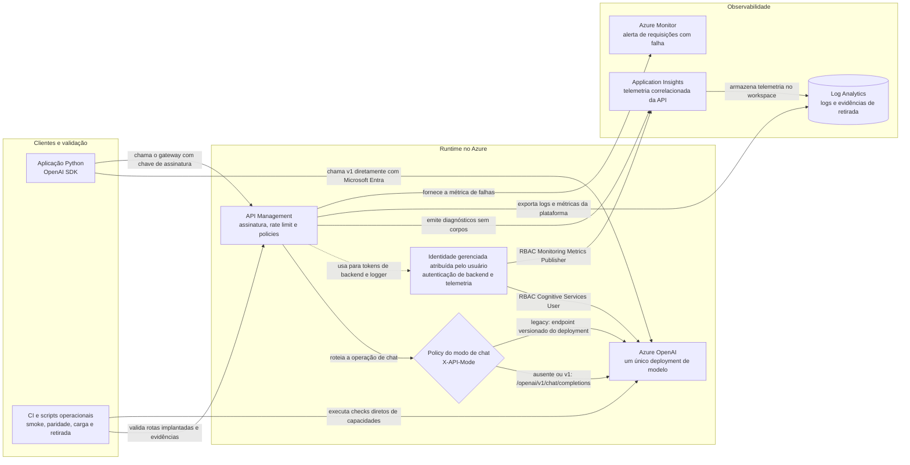

# Guia de migração para OpenAI SDK e API v1

**Público:** equipes de arquitetura, desenvolvimento, segurança e operação

**Data:** 19 de agosto de 2026

**Objetivo:** migrar aplicações que usam Azure AI Inference SDK e a rota `/models` para o SDK OpenAI e a API `/openai/v1/`

**Prazo de referência:** 26 de agosto de 2026 para a retirada do Azure AI Inference beta SDK

## Resumo executivo

A mudança obrigatória se aplica às aplicações que usam o pacote `azure-ai-inference`, o cliente `ChatCompletionsClient` ou endpoints terminados em `/models`. Essas aplicações devem adotar o pacote estável `openai` e o endpoint `/openai/v1/`.

A migração preserva o deployment do modelo. A principal mudança ocorre no cliente, na URL e na autenticação. O nome do deployment passa a ser informado no parâmetro `model`, e a URL deixa de usar um `api-version` datado.

O fluxo recomendado para o cliente é:

1. Inventariar aplicações e identificar chamadas legadas.
2. Preparar um ambiente isolado e configurar identidade e RBAC.
3. Migrar o cliente para o SDK OpenAI.
4. Atualizar as rotas e policies do API Management, quando aplicável.
5. Executar testes diretos e pelo gateway.
6. Promover a mudança de forma controlada, com rollback preparado.

## Como identificar o cenário

| Evidência na aplicação | Classificação | Ação |
| --- | --- | --- |
| Pacote `azure-ai-inference` | Migração obrigatória | Substituir pelo pacote `openai` |
| Classe `ChatCompletionsClient` | Migração obrigatória | Substituir por `OpenAI` ou `AsyncOpenAI` |
| URL com `.services.ai.azure.com/models` | Migração obrigatória | Alterar para `.openai.azure.com/openai/v1/` |
| URL com `/openai/deployments/<deployment>` e `api-version` | Formato ainda suportado | Planejar adoção de `/openai/v1/` |
| SDK `openai` e URL `/openai/v1/` | Formato de destino | Validar versão, autenticação e testes |

## Arquitetura de referência



Todos os caminhos de requisição chegam ao mesmo deployment do modelo. O API Management é opcional. Quando utilizado, ele centraliza autenticação do consumidor, limites, telemetria e políticas operacionais. A autenticação entre APIM e Azure OpenAI usa identidade gerenciada. O modo opcional de rede privada coloca o APIM em uma VNet e acessa o Azure OpenAI por private endpoint e DNS privado.

## Responsabilidades sugeridas

| Equipe | Responsabilidade |
| --- | --- |
| Aplicação | Atualizar dependências, cliente, endpoint e testes |
| Plataforma Azure | Preparar Azure OpenAI, deployment, APIM, identidade e RBAC |
| Segurança | Aprovar autenticação, armazenamento de segredos e logs |
| Operação | Definir alertas, limites, rollback e critérios de produção |
| Negócio ou produto | Validar respostas e comportamento esperado |

## Passo 1: inventariar as aplicações

Pesquisar nos repositórios e configurações por:

```text
azure-ai-inference
ChatCompletionsClient
services.ai.azure.com/models
/openai/deployments/
api-version=
```

O scanner incluído gera saída em texto, JSON ou SARIF e pode cobrir várias raízes:

```powershell
python .\migration_scan.py C:\Git\aplicacao-a C:\Git\aplicacao-b `
    --format sarif `
    --output migration-scan.sarif `
    --fail-on-findings
```

Use `--fail-on-findings` como gate nos repositórios consumidores depois de aprovar o baseline. O repositório desta POC mantém implementações legadas para comparação e, portanto, publica o SARIF no CI sem exigir zero findings.

Para cada consumidor, registrar:

| Informação | Exemplo |
| --- | --- |
| Aplicação e responsável | Assistente interno, equipe de Canais |
| Ambiente | Desenvolvimento, homologação ou produção |
| SDK e versão | `azure-ai-inference` |
| Endpoint atual | `/models` ou `/openai/deployments/...` |
| Modelo e deployment | `gpt-4.1-mini`, `chat-prod` |
| Autenticação | Chave, Microsoft Entra ID ou APIM |
| Capacidades usadas | Chat, streaming, tools, embeddings ou imagens |
| Volume e limite atual | Requisições por minuto e tokens por minuto |

O inventário define o tamanho da mudança e evita que uma capacidade opcional fique sem teste.

## Passo 2: preparar o ambiente

Pré-requisitos para executar a POC:

- Python 3.10 ou posterior.
- Azure CLI e Azure Developer CLI autenticadas.
- Deployment de modelo ativo.
- Permissão de leitura no APIM.
- Acesso de inferência para a identidade usada no teste direto.
- Papel `Cognitive Services User` para a identidade gerenciada do APIM no recurso de IA.

Preparar o ambiente Python:

```powershell
python -m venv .venv
.\.venv\Scripts\Activate.ps1
python -m pip install -r requirements.txt
```

O projeto fixa o SDK em `openai>=2.0,<3` para garantir o comportamento esperado do provedor de token Microsoft Entra ID.

## Passo 3: migrar o código

### Implementação anterior

```python
from azure.ai.inference import ChatCompletionsClient
from azure.core.credentials import AzureKeyCredential

client = ChatCompletionsClient(
    endpoint="https://<recurso>.services.ai.azure.com/models",
    credential=AzureKeyCredential(api_key),
)
```

### Implementação com API v1

```python
from azure.identity import DefaultAzureCredential, get_bearer_token_provider
from openai import OpenAI

credential = DefaultAzureCredential()
token_provider = get_bearer_token_provider(
    credential,
    "https://ai.azure.com/.default",
)

client = OpenAI(
    base_url="https://<recurso>.openai.azure.com/openai/v1/",
    api_key=token_provider,
)

response = client.chat.completions.create(
    model="<nome-do-deployment>",
    messages=[{"role": "user", "content": "Responda apenas OK"}],
)
```

Pontos que devem ser revisados no pull request:

- Remover a dependência `azure-ai-inference` quando nenhum consumidor restante precisar dela.
- Usar o nome do deployment no parâmetro `model`.
- Remover `api-version` da URL v1.
- Remover rotas `/models` e `/openai/deployments/` do novo cliente.
- Configurar timeout, retry e cancelamento.
- Não registrar tokens, chaves, prompts ou respostas sensíveis.

## Passo 4: configurar o API Management

No frontend do APIM:

1. Publicar o prefixo `/openai/v1/`.
2. Exigir uma assinatura ou outro mecanismo aprovado para os consumidores.
3. Criar operações somente para as capacidades liberadas.
4. Aplicar limites coerentes com a quota do deployment.

No backend do APIM:

1. Encaminhar para `https://<recurso>.openai.azure.com/openai`.
2. Remover o cabeçalho `Authorization` recebido do cliente, quando o gateway assumir a autenticação.
3. Obter um token com a identidade gerenciada e o recurso `https://ai.azure.com`.
4. Enviar o token ao Azure OpenAI.
5. Não adicionar `api-version` à requisição v1.

O cliente OpenAI controla retries de `429`. A policy APIM controla somente retries de `5xx`. Não repita `429` nas duas camadas, pois o número efetivo de tentativas se multiplica e mascara throttling e consumo de quota.

Na fachada temporária de chat, o branch `legacy` usa o mesmo backend Azure OpenAI, a audiência `https://cognitiveservices.azure.com` e a rota `/openai/deployments/<deployment>/chat/completions?api-version=2024-10-21`. O branch `v1` usa `/openai/v1/chat/completions` e `https://ai.azure.com`. O header `X-API-Mode` não é encaminhado ao backend.

Validar a configuração implantada:

```powershell
python .\validate_apim.py `
  --resource-group '<resource-group>' `
  --service-name '<apim-name>' `
  --api-id '<api-id>'
```

Resultado esperado:

```text
[PASS] OpenAI v1 APIM configuration: No incompatible configuration was detected.

Summary: 0 error(s), 0 warning(s)
```

## Passo 5: executar os testes

### Testes determinísticos

```powershell
python -m pytest -q
```

Esses testes validam montagem dos clientes, retry, cancelamento, comparação de respostas e regras da auditoria APIM sem consumir o modelo.

### Smoke test direto

```powershell
$env:AZURE_OPENAI_BASE_URL = 'https://<recurso>.openai.azure.com/openai/v1/'
$env:AZURE_OPENAI_DEPLOYMENT = '<nome-do-deployment>'
python .\smoke_test.py --target direct
```

### Smoke test pelo APIM

```powershell
$env:APIM_OPENAI_BASE_URL = 'https://<apim>.azure-api.net/openai/v1/'
$env:APIM_SUBSCRIPTION_KEY = '<chave-obtida-de-forma-segura>'
$env:AZURE_OPENAI_DEPLOYMENT = '<nome-do-deployment>'
python .\smoke_test.py --target apim
```

### Coexistência temporária

Durante uma migração em etapas, a mesma versão da aplicação pode manter os dois clientes e selecionar um por configuração. As URLs, os SDKs e os escopos de autenticação permanecem separados:

| Modo | SDK | Endpoint | Escopo Entra ID |
| --- | --- | --- | --- |
| `legacy` | `azure-ai-inference` | `https://<recurso>.services.ai.azure.com/models` | `https://cognitiveservices.azure.com/.default` |
| `v1` | `openai` | `https://<recurso>.openai.azure.com/openai/v1/` | `https://ai.azure.com/.default` |

```powershell
$env:LEGACY_MODELS_BASE_URL = 'https://<recurso>.services.ai.azure.com/models'
$env:AZURE_OPENAI_BASE_URL = 'https://<recurso>.openai.azure.com/openai/v1/'
$env:AZURE_OPENAI_DEPLOYMENT = '<nome-do-deployment>'

python .\smoke_test.py --api-mode legacy --target direct
python .\smoke_test.py --api-mode v1 --target direct
python .\compare_responses.py --target direct
```

Para substituir um prompt isolado por evidência repetível, use o corpus versionado:

```powershell
python .\compare_responses.py --target apim `
    --corpus .\samples\parity-corpus.jsonl `
    --min-pass-rate 1.0 `
    --output .\parity-report.json
```

Cada linha JSONL contém `id` e `prompt`. Ela pode definir `max_tokens`, `max_length_ratio`, `expected_finish_reason`, `expected_tool_call_count`, `tools`, `tool_choice` e `response_format`. O relatório armazena métricas normalizadas e resultados dos checks, sem o conteúdo gerado.

Para chat, o APIM provisionado pela POC usa a operação existente `/openai/v1/chat/completions`. Header ausente mantém v1; o smoke test envia `X-API-Mode` conforme `--api-mode`:

```powershell
$env:APIM_OPENAI_BASE_URL = 'https://<apim>.azure-api.net/openai/v1/'
$env:APIM_SUBSCRIPTION_KEY = '<chave-obtida-de-forma-segura>'
$env:AZURE_OPENAI_DEPLOYMENT = '<nome-do-deployment>'

python .\smoke_test.py --api-mode v1 --target apim
python .\smoke_test.py --api-mode legacy --target apim
```

`v1` é o modo padrão. Apenas chat é dual-mode no APIM; as capacidades avançadas são validadas somente em v1. Registre telemetria por modo, defina a data para remover o backend legado e não use fallback silencioso: uma falha em v1 deve ser visível, não redirecionada automaticamente para `/models`.

O endpoint direto `.services.ai.azure.com/models` representa um serviço Azure AI Models externo e não é criado pelo Bicep desta POC. A infraestrutura implantada cria somente o recurso Azure OpenAI usado pelo v1 e pelos dois branches APIM.

Remover a chave da sessão ao final:

```powershell
Remove-Item Env:APIM_SUBSCRIPTION_KEY -ErrorAction SilentlyContinue
```

### Capacidades usadas pela aplicação

```powershell
python .\capability_test.py --target direct --capability all
```

Resultados `skipped` indicam que a capacidade depende de outro deployment, arquivo ou autorização para criar recursos. Eles devem ser comparados com o inventário do Passo 1. Uma capacidade usada em produção não pode permanecer como `skipped` no aceite.

Batch e fine-tuning criam recursos e somente devem ser executados em ambiente autorizado com `--execute-mutating`. Sem essa flag, o bloqueio ocorre antes de upload ou chamada de criação. Capacidades sem configuração retornam `skipped`; trate como bloqueante qualquer capacidade usada pela aplicação.

## Passo 6: validar comportamento e operação

Além do status HTTP, comparar:

- Presença e qualidade mínima da resposta.
- Streaming e ordem dos eventos.
- Chamadas de ferramentas e argumentos JSON.
- Respostas estruturadas contra o schema esperado.
- Tratamento de `401`, `403`, `429`, timeout e cancelamento.
- Latência nos percentis acordados.
- Consumo de tokens e custo estimado.
- Conteúdo bloqueado pelos filtros de segurança.

Executar carga controlada somente com limites aprovados:

```powershell
python .\load_test.py --target apim --api-mode both --requests 20 --concurrency 4
```

O teste executa primeiro v1 e depois legacy, com relatórios separados. `--requests` vale para cada modo; o comando acima envia 40 chamadas no total. O projeto limita cada modo a 10.000 requisições e concorrência 100, exigindo `--confirm-large-load` acima de 1.000 requisições por modo. Para produção, os limites devem refletir quota, capacidade do APIM e orçamento do cliente.

Para executar 10.000 chamadas totais, divididas igualmente entre v1 e legacy, use `--api-mode both --requests 5000 --concurrency 1 --confirm-large-load`.

## Passo 7: promover para produção

Sequência recomendada:

1. Congelar a configuração validada em infraestrutura como código.
2. Implantar uma revisão candidata no APIM.
3. Executar auditoria, smoke test e carga limitada na revisão candidata.
4. Validar métricas e logs sem conteúdo sensível.
5. Promover a revisão.
6. Repetir o smoke test pelo endpoint estável.
7. Monitorar erros, latência, tokens e throttling durante a janela acordada.

O SKU Developer do APIM é adequado para POC e não possui SLA de produção. A entrada em produção exige um SKU com SLA, capacidade, rede e disponibilidade compatíveis com os requisitos do cliente.

## Passo 8: comprovar a retirada do legado

O relatório de retirada consulta traces de roteamento e requests correlacionados no Application Insights:

```powershell
python .\retirement_report.py `
    --application-insights-name '<nome-do-componente>' `
    --subscription-id '<subscription-id>' `
    --resource-group '<resource-group>' `
    --legacy-p95-baseline-ms '<baseline-aprovado-em-ms>' `
    --rollback-rehearsed `
    --parity-passed `
    --owner-approved `
    --require-ready `
    --output .\retirement-report.json
```

O resultado só marca `ready: true` quando todos os critérios passam: telemetria completa, tráfego v1 observado, zero tráfego legado por 14 dias, sucesso v1 mínimo de 99,5%, p95 v1 até 10% acima do baseline legado, paridade aprovada, rollback ensaiado e aprovação do responsável. Dados ou aprovações ausentes produzem uma decisão não pronta. As janelas de 7, 14 e 30 dias permanecem no artefato para revisão.

O workflow manual `Live migration gate` executa o corpus e, para o alvo APIM, gera essa evidência. Informe os inputs de Application Insights e resource group. Use `enforce_retirement_ready` somente na execução que deve bloquear a decisão. Os artefatos `parity-report.json` e `retirement-report.json` são publicados mesmo em caso de falha.

## Plano de rollback

Antes da promoção, manter:

- Revisão anterior do APIM disponível.
- Versão anterior da aplicação implantável.
- Configuração e segredos anteriores no cofre aprovado.
- Critérios objetivos para acionar rollback.

Acionar rollback quando ocorrer qualquer condição acordada, como aumento sustentado de erros, regressão funcional, latência acima do limite ou falha de autenticação. Após restaurar a versão anterior, repetir o smoke test e registrar o incidente.

O rollback é uma proteção operacional. Ele não elimina a necessidade de concluir a migração do Azure AI Inference SDK antes da data de retirada.

## Critérios de aceite

| Critério | Evidência esperada |
| --- | --- |
| SDK estável | Dependência `openai>=2.0,<3` instalada |
| Endpoint v1 | URL termina em `/openai/v1/` |
| Deployment | Parâmetro `model` contém o nome do deployment |
| API v1 limpa | Nenhuma chamada v1 usa `/models` ou `api-version` |
| Legado isolado | A rota versionada existe somente no branch legado da fachada |
| APIM | Auditoria termina com zero erros e zero avisos |
| Chamada direta | Resposta não vazia e status de sucesso |
| Chamada pelo gateway | Resposta não vazia e status de sucesso |
| Segurança | Chave inválida retorna `401` ou `403` |
| Identidade | APIM autentica no backend com identidade gerenciada |
| Observabilidade | Status e latência disponíveis sem conteúdo sensível |
| Capacidades | Todas as capacidades usadas pelo cliente foram exercitadas |
| Rollback | Procedimento documentado e testado |

## Evidências obtidas nesta POC

| Validação | Resultado |
| --- | --- |
| Suíte automatizada | 22 testes aprovados antes da adição do modo de carga dual |
| Compilação Bicep | Aprovada; um aviso de `dependsOn` redundante não bloqueante |
| Provisionamento Azure | Concluído com sucesso |
| Auditoria APIM live | 0 erros e 0 avisos |
| Smoke test direto | Resposta `POC SDK OpenAI v1 OK` |
| Smoke test APIM v1 | Resposta `POC SDK OpenAI v1 OK`, latência observada de 5.340 ms |
| Smoke test APIM legacy | Resposta `POC SDK OpenAI v1 OK`, latência observada de 18.944 ms |
| Chat | Aprovado |
| Streaming | Aprovado |
| Responses API | Aprovado |
| Tool calling | Aprovado |
| Structured output | Aprovado |

Embeddings, imagens, áudio e safety não foram exercitados porque dependem de deployments, arquivos ou parâmetros opcionais. Batch e fine-tuning não foram executados porque criam recursos. O cliente deve executar apenas as capacidades presentes no seu inventário e em ambiente autorizado.

## Diagnóstico rápido

| Sintoma | Verificação | Correção comum |
| --- | --- | --- |
| `401` no Azure OpenAI | Audiência do token e RBAC | Usar `https://ai.azure.com/.default` e revisar o papel da identidade |
| `401` no APIM | Chave e endpoint do gateway | Recuperar uma chave ativa e confirmar `/openai/v1/` |
| `403` no backend | Identidade gerenciada do APIM | Atribuir `Cognitive Services User` no recurso de IA |
| `404` | Deployment, operação ou rota | Confirmar `model`, API ID e operação publicada |
| `429` | Quota e políticas de limite | Reduzir concorrência, aplicar retry e revisar quota |
| Timeout | Latência e limites do cliente/APIM | Ajustar timeout e investigar métricas do backend |
| Capacidade `skipped` | Variável ou deployment ausente | Configurar somente a capacidade usada pelo cliente |

## Segurança e tratamento de dados

- Armazenar chaves em cofre ou secret store aprovado.
- Preferir Microsoft Entra ID e identidade gerenciada no backend.
- Não gravar chaves em código, arquivos do repositório ou logs.
- Não exportar prompts e respostas reais como evidência da migração.
- Usar dados sintéticos e prompts aprovados durante os testes.
- Registrar request ID, horário, status e latência para investigação.
- Rotacionar chaves APIM de forma gradual e validar o novo slot antes de invalidar o anterior.

## Referências oficiais

- [Migração do Azure AI Inference SDK para OpenAI SDK](https://learn.microsoft.com/azure/foundry/how-to/model-inference-to-openai-migration)
- [Endpoints do Microsoft Foundry](https://learn.microsoft.com/azure/foundry/foundry-models/concepts/endpoints)
- [Ciclo de vida da API v1](https://learn.microsoft.com/azure/foundry/openai/api-version-lifecycle)
- [Referência REST do Azure OpenAI](https://learn.microsoft.com/azure/foundry/openai/reference)
- [Autenticação do Azure OpenAI no APIM](https://learn.microsoft.com/azure/api-management/api-management-authenticate-authorize-azure-openai)
- [Ciclo de vida dos modelos](https://learn.microsoft.com/azure/foundry/openai/concepts/model-retirements)
